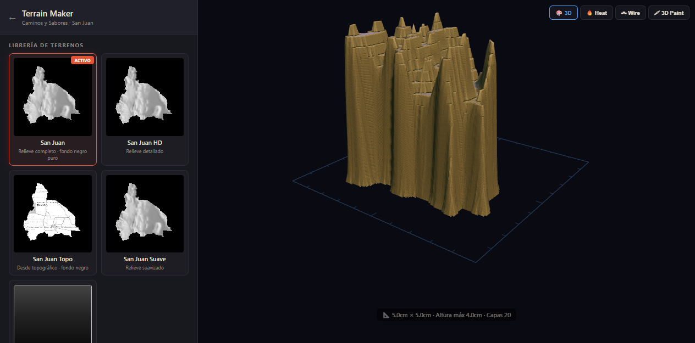

# 3D Layer Terrain Generator



Convert grayscale heightmap images into **3D layered topographic models** optimized for CNC routing and laser-cut physical maquettes.

## Features

- **Heightmap Upload** — Drop a grayscale image (black = flat, white = peak) and instantly get a 3D terrain.
- **Resolution Control** — Grid resolution from 32×32 up to 2048×2048 vertices.
- **Quantized Layers** — Discrete height steps (3–30 layers) for physical layer construction.
- **Real-time Brushes** — Paint directly on the 2D preview or on the 3D mesh with raycast painting.
- **Brightness / Contrast** — Adjust elevation spread in real time.
- **3D Viewport** — Three.js with orbit controls, heat map overlay, wireframe mode.
- **3D Paint Mode** — Click and drag on the terrain to sculpt with adjustable strength (+/—).
- **Measurement Rulers** — Perimeter ruler and dimension overlay for maquette planning.
- **Export** — STL (3D print / CNC), GLB (Blender / Unity), SVG contour layers (laser cutter).

## Quick Start

```bash
git clone https://github.com/jpupper/3dlayerterraingenerator.git
cd 3dlayerterraingenerator
npm install
npm start
```

Then open `http://localhost:4938` in your browser.

## How It Works

1. **Load a terrain** from the library (San Juan, default hill) or **upload your own heightmap**.
2. **Adjust parameters**: resolution, layer count, max height, smoothing, brightness/contrast.
3. **Paint** with the 2D brush or toggle **3D Paint** to sculpt directly on the mesh.
4. **Export** as STL for CNC, GLB for 3D software, or SVG layer contours for laser cutting.

## API Endpoints

| Method | Endpoint | Description |
|--------|----------|-------------|
| GET | `/api` | API info |
| POST | `/api/heightmap` | Upload a heightmap image |
| POST | `/api/model` | Upload a 3D model (STL/GLB) |
| POST | `/api/terrain` | Save a terrain project (JSON) |
| GET | `/api/terrains` | List saved terrains |
| GET | `/api/terrain/:id` | Load a saved terrain |
| DELETE | `/api/terrain/:id` | Delete a saved terrain |

## Tech Stack

- **Frontend**: Vanilla JS + Three.js (CDN)
- **Backend**: Node.js + Express
- **3D Engine**: Three.js (OrbitControls, Raycaster, STLExporter, GLTFExporter)
- **Storage**: Local filesystem + optional Cloudinary

## Deployment

The app runs on any Node.js server. Example nginx reverse proxy config:

```nginx
server {
    listen 80;
    server_name yourdomain.com;

    location / {
        proxy_pass http://127.0.0.1:4938;
        proxy_http_version 1.1;
        proxy_set_header Upgrade $http_upgrade;
        proxy_set_header Connection 'upgrade';
        proxy_set_header Host $host;
        proxy_cache_bypass $http_upgrade;
    }
}
```

## License

MIT
